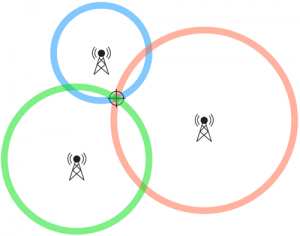

# SCADA ICS Attacks

Guest: OccupyTheWeb, a OSINT Expert

Credit: [David Bombal - Hacking Power Plants and Industrial Control Systems (Scada)](https://youtu.be/uXbGQiXsRes)

***

In the 1-hour YouTube interview, OccupyTheWeb explains what is the OSINT, government surveillance and several SCADA ICS Attacks.

* [OSINT](2022-04-18-scada.md#osint)
* [Government Surveillance](2022-04-18-scada.md#government-surveillance)
* [SCADA ICS Attacks](2022-04-18-scada.md#scada-ics-attacks)

\

### OSINT

He traced Russia yachts by using OSINT which including a marina tracking website. [Marina Traffic](https://www.marinetraffic.com) is a open source intelligence website for users to trace global marina traffic. **It is totally free!**

That is one of the reason why Russia yachts is seized by other countries.

\

### Government Surveillance

It is common that local government used to track their citizen via landline and cell phone network. Even we turn off our mobile GPS feature, they can still recognize where you are by triangulate with cell phone towers. OccupyTheWeb uses burner phone to against tracking

_Credit:_ [_4n6.com_](https://4n6.com/cell-phone-triangulation)

\

### SCADA ICS Attacks

📖Jargons:

* SCADA = Supervisory Control and Data Acquisition
* ICS = Industrial Control System

\
SCADA is commonly used by infrastructure facilities such as water supply and refinery. It helps control the machine with PLCs (programmable logic controller). However, OccupyTheWeb stated that those systems are **`fully vulnerable`** because of their unencrypted protocols and legacy systems. They are developed in 80's without any updates. The most easiest solution is adding target IP addresses into their Whitelist to allow accessing internal SCADA network.

\
There are several SCADA ISC attacks:

* Stuxnet (US->Iran)
* Colonial Pipeline (?->US)
* Schneider Electric (OccupyTheWeb)

\
📺**Latest News - Ukraine's infrastructure**

They can be attacked by Russia because their systems are using common protocol of SCADA ICS:

(_They are not in the TCP/IP suite_)

* Modbus - _Port 502_
* Profinet
* OPC

\
It will affect their daily life with gasline shortage by blowing up the refinery. They should patch the vulnerabilities to against simple or even sophisticated attacks
